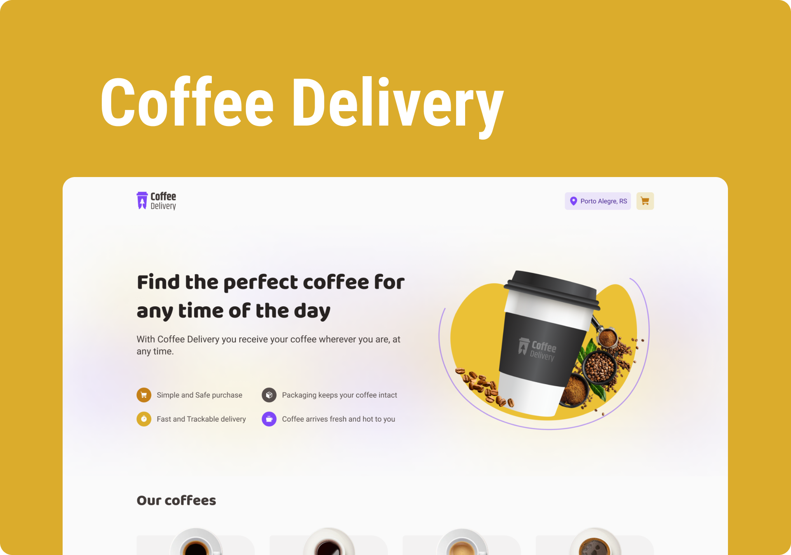

    

<h1 align="center">
	Delivery Coffee Shop
</h1>

## 🚀 Project

A delivery coffee shop website where you can choose from a variate list of coffees and drinks.

---

## 🔧 Technologies

- Vite
- ReactJS
- TypeScript
- zod
- React-Hook-Form

---

## 🧑‍💻 How to execute

- Clone the repository

- Run ' npm install '

- Run ' npm run dev ' and access the link that will apear on your terminal to open the project on your Browser

- And that's it, have fun :)

---

Made by <a href="https://twitter.com/RafaMartins_dev" target="_blank">Rafa Martins</a>
